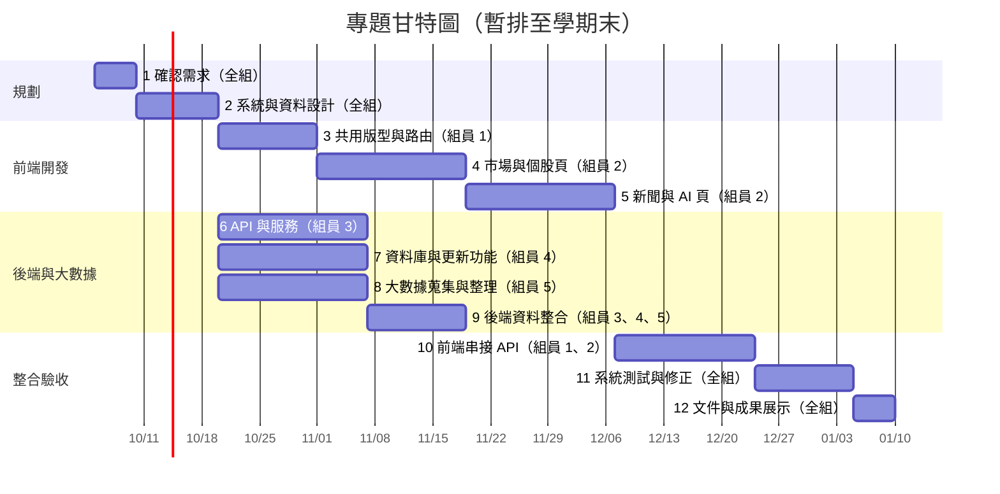
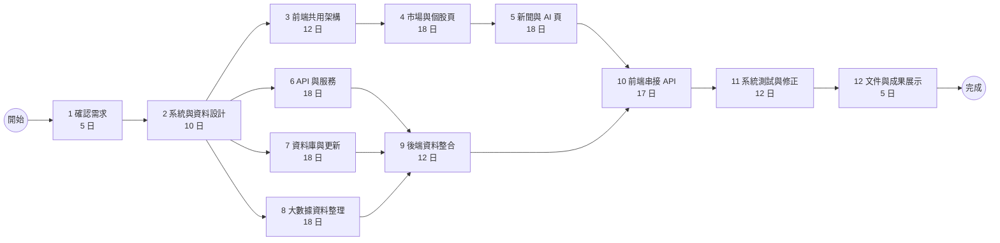

# 專題任務與進度

組員 1:組員 1 組員 1 組員 1 組員 1

## 組員分工

| 組員 | 分工 | 主要任務 |
| --- | --- | --- |
| 組員 1 | 前端 | 共用版型、路由、頁面整合與前後端串接 |
| 組員 2 | 前端 | 市場、個股、新聞與 AI 分析頁面 |
| 組員 3 | 後端 | API 與後端服務功能 |
| 組員 4 | 後端 | 資料庫、資料更新與查詢 |
| 組員 5 | 大數據 | 行情、財務與新聞資料整理、清理與彙整 |

## 任務表

| 任務 | 說明 | 負責人 | 需時（日） | 前置任務 |
| ---: | --- | --- | ---: | --- |
| 1 | 確認專題需求與功能範圍 | 全組 | 5 | - |
| 2 | 系統架構、畫面與資料規格設計 | 全組 | 10 | 1 |
| 3 | 前端共用版型、路由與元件 | 組員 1 | 12 | 2 |
| 4 | 市場首頁與個股資料頁 | 組員 2 | 18 | 3 |
| 5 | 新聞中心與 AI 分析頁 | 組員 2 | 18 | 4 |
| 6 | 後端 API 與服務功能 | 組員 3 | 18 | 2 |
| 7 | 資料庫設計與資料更新功能 | 組員 4 | 18 | 2 |
| 8 | 大數據資料蒐集、清理與彙整 | 組員 5 | 18 | 2 |
| 9 | 後端串接資料庫與整理後資料 | 組員 3、4、5 | 12 | 6、7、8 |
| 10 | 前端串接 API 與資料呈現 | 組員 1、2 | 17 | 4、5、9 |
| 11 | 全系統測試與問題修正 | 全組 | 12 | 10 |
| 12 | 使用說明、展示準備與成果整理 | 全組 | 5 | 11 |

## 甘特圖

排程暫以 2026-10-05 開始、2027-01-10 學期末為目標；前端、後端與大數據工作在規格完成後並行進行。

## PERT／CPM 圖

依目前估算，關鍵路徑為 **1 → 2 → 3 → 4 → 5 → 10 → 11 → 12**，預估共 **97 日**，約於 2027-01-10 完成。

