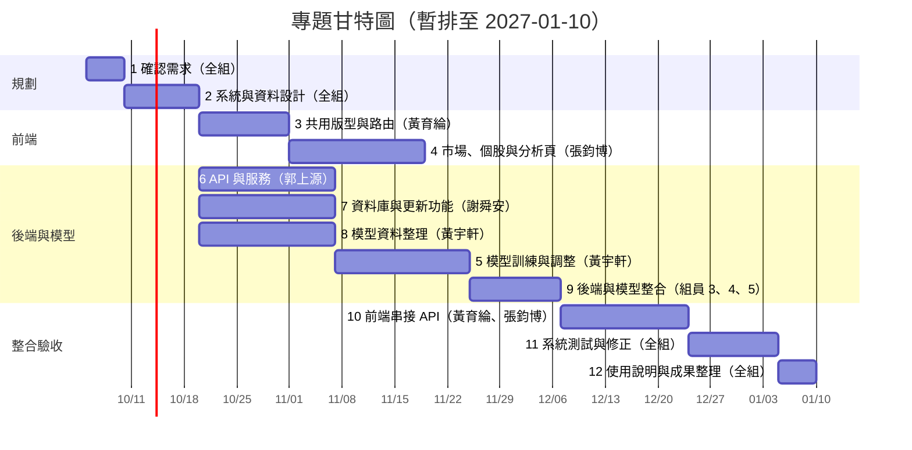
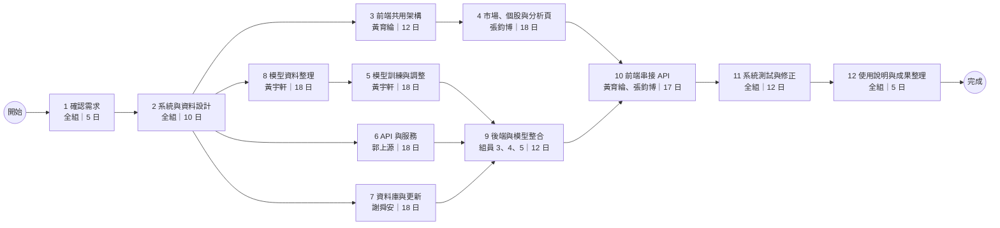

# 專題任務與進度

## 組員名單與分工

| 組員 | 姓名 | 分工 | 主要任務 |
| ---: | --- | --- | --- |
| 1 | 黃育綸 | 前端 | 共用版型、路由、頁面整合與前後端串接 |
| 2 | 張鈞博 | 前端 | 市場、個股、新聞與 AI 分析頁面 |
| 3 | 郭上源 | 後端 | API 與後端服務功能 |
| 4 | 謝舜安 | 後端 | 資料庫、資料更新與查詢 |
| 5 | 黃宇軒 | 模型訓練 | 資料整理、模型訓練與效果調整 |

## 任務表

| 任務 | 說明 | 負責人 | 需時（日） | 前置任務 |
| ---: | --- | --- | ---: | --- |
| 1 | 確認專題需求與功能範圍 | 全組 | 5 | - |
| 2 | 系統架構、畫面與資料規格設計 | 全組 | 10 | 1 |
| 3 | 前端共用版型、路由與元件 | 黃育綸 | 12 | 2 |
| 4 | 市場、個股、新聞與 AI 分析頁 | 張鈞博 | 18 | 3 |
| 5 | 模型訓練與效果調整 | 黃宇軒 | 18 | 8 |
| 6 | 後端 API 與服務功能 | 郭上源 | 18 | 2 |
| 7 | 資料庫設計與資料更新功能 | 謝舜安 | 18 | 2 |
| 8 | 模型資料蒐集、清理與彙整 | 黃宇軒 | 18 | 2 |
| 9 | 後端串接資料庫、整理後資料與模型 | 郭上源、謝舜安、黃宇軒 | 12 | 5、6、7 |
| 10 | 前端串接 API 與資料呈現 | 黃育綸、張鈞博 | 17 | 4、9 |
| 11 | 全系統測試與問題修正 | 全組 | 12 | 10 |
| 12 | 使用說明與成果整理 | 全組 | 5 | 11 |

## 甘特圖

## PERT／CPM 圖

預估關鍵路徑：**1 → 2 → 8 → 5 → 9 → 10 → 11 → 12**，共 **97 日**，目標於 **2027-01-10** 完成。

